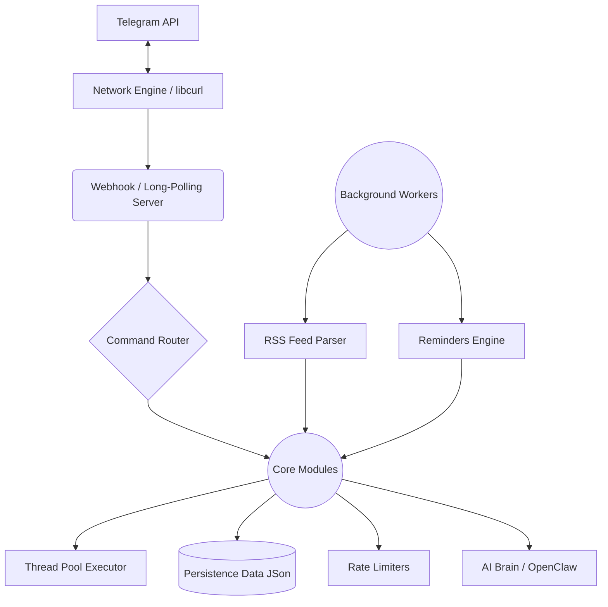

# Super TelegramBot

A robust, production-grade Telegram bot implementation in modern C++ featuring command routing, persistent state, background threading, and extensive built-in functionality.

## ✨ Features

### Core Architecture



- **Modern C++23**: Built with safety, speed, and modern paradigms.
- **Dual Modes**: Supports both **Long-Polling** and **Webhook** operation modes.
- **Thread Pool**: Asynchronous command execution so slow network calls don't block the bot.
- **Rate Limiting**: Includes both inbound (per-user) and outbound (global and per-chat) rate limiting to comply with Telegram API limits.
- **Persistence**: Automatically saves dynamic data (reminders, RSS feeds, custom commands, state) to disk (`data/bot_data.json`).

### Built-in Commands & Utilities
- **`/help`**: Auto-generated list of available commands with descriptions.
- **`/time`**: Check the server time.
- **`/echo <text>`**: Echoes messages back to the user.
- **`/status`**: View system health metrics (CPU, RAM, Uptime).
- **`/id`**: Show your unique user and chat IDs.
- **`/convert <amount> <from> <to>`**: Real-time currency and crypto conversion (e.g., `/convert 1 BTC USD`).
- **`/remindme <time> <msg>`**: Set async reminders (e.g., `/remindme 10m check oven`).
- **`/calc <expr>`**: Advanced mathematical expression evaluator.
- **`/addcmd <name> <type> <content>`**: Define custom dynamic or static commands on the fly. 
- **`/menu`**: Example of interactive inline keyboards.

### 🧠 AI Brain Integration
- **`/ai <query>`**: Talk to the bot's integrated AI brain (powered by OpenAI / OpenClaw compatible APIs).

### 📰 RSS Feed Engine
A background engine that automatically polls RSS feeds (default every 15 mins) and pushes new articles to chats. Features robust anti-bot bypass mechanisms and HTML detection. 
- **`/rss_add <url>`**: Subscribe to a new RSS feed.
- **`/rss_list`**: View active subscriptions.
- **`/rss_remove <url>`**: Remove an RSS feed.
- **`/rss_config <url> <emoji|title> <val>`**: Customize feed appearance in your chat.

### 🛡️ Group Management
- **`/admin <user_id>`**: Basic moderation tools (Ban/Promote via inline keys).
- **`/setwelcome <msg>`**: Configure a welcome message for new members.
- **`/addfilter <word>`** & **`/listfilters`**: Manage a list of forbidden words to automatically delete violating messages.

## 🛠️ Requirements

- CMake 3.23+
- C++23 compiler
- libcurl
- jsoncpp
- pugixml (for RSS parsing)

## ⚙️ Configuration

Before running the bot, you should configure it via the `config/system-config.json` file. Here are some of the key settings:

```json
{
    "debug": true,
    "token": "YOUR_TELEGRAM_BOT_TOKEN_HERE",
    "ai_api_key": "YOUR_OPENAI_OR_OPENCLAW_API_KEY",
    "thread_pool_size": 4,
    "long_poll_timeout": 30,
    "rss_check_interval": 300,
    "webhook": {
        "enabled": false,
        "url": "https://yourdomain.com",
        "path": "/webhook",
        "port": 8443
    }
}
```

- **`token`**: Your Telegram bot token retrieved from [@BotFather](https://t.me/BotFather).
- **`ai_api_key`**: Your API key used for the `/ai` command (OpenAI compatible).
- **`thread_pool_size`**: Number of threads to use for background command processing.
- **`rss_check_interval`**: How often the bot checks for new RSS items (in seconds).
- **`webhook`**: Configure if you want to run the bot using incoming Webhooks rather than Long-Polling (`enabled: true/false`).

## 🚀 Build & Run

Use a clean build directory:

```bash
# Configure and Build
cmake -S . -B build
cmake --build build

# Edit Configuration
# Modify config/system-config.json to set your bot token, RSS interval, webhook settings, etc.

# Run the Bot
./TelegramBot
# Or pass the token as an argument:
# .TelegramBot <BOT_TOKEN>
```

## 🧪 Test

```bash
ctest --test-dir build --output-on-failure
```
Current test coverage includes `RateLimiter`, `OutboundRateLimiter`, `Network`, `JSON parsing`, and `StateManager` units.
